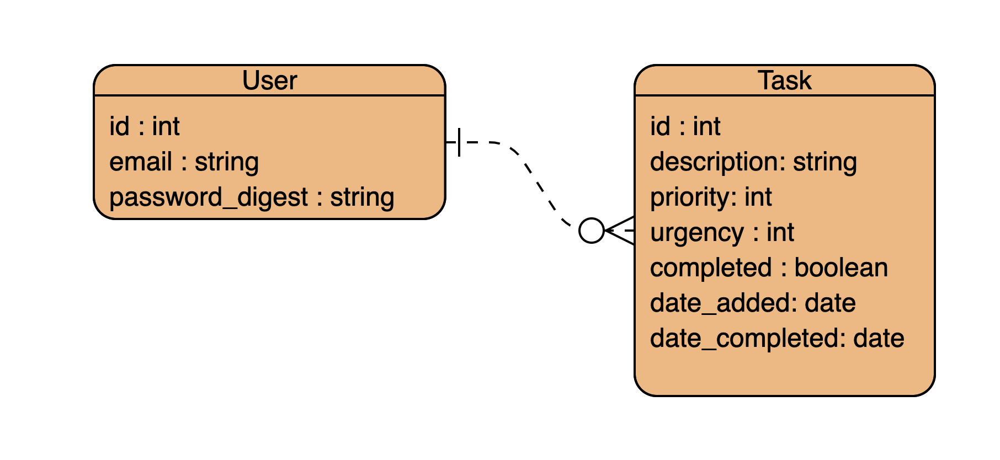

# One Thing Well

One Thing Well is a todo application that helps you focus on the one thing that you need to (or want to) work on right now. It's easy to look at a long list of items to do and get stuck trying to decide which one is most important or urgent and wind up either fiddling with the list, or get overwhelmed and wind up doing nothing at all. Here, you'll add all of your todos (no matter how big or small) to one "bucket", and OTW will choose one for you at random to focus on. As you use the app, it will try to learn what's more important or urgent for you, and help you get those done, while still throwing you some surprises every now and then.

This is the repo for the back end, and you can visit the hosted app [here](http://some.hosting.service/myapp). The front end repo is [here](http://github.com/itsame/myapp-backend), which documents the user stories and UI structure of the app.

## Models and Relationships

The models for this app are relatively simple:



### User

A `User` has many `Tasks`

* id : int
* email : string
* password_digest : string

### Task

A `Task` belongs to a `User`

* id : int
* description : string
* importance : int (1-10)
* urgency : int (1-10)
* completed : boolean
* date_added : date
* date_completed : date
* user_id : int

## API

### POST /users

Creates a new user. Returns the user object.

```json
  { 
    email: "spike@bebop.com",
    password: "$v1c10us!Sux%",
    confirm_password: "$v1c10us!Sux%",
  }
```

### POST /login

Logs a user in with email and password. When a user logs in, a random set of tasks have their urgency or importance increased by a point or two.

```json
  { 
    email: "spike@bebop.com",
    password: "$v1c10us!Sux%",
  }
```

### GET /tasks

Returns a dump of all the user's task info. Not exposed in the app.

```json
  { tasks: [
    {
      id: 1,
      description: "Get a haircut",
      importance: 1,
      urgency: 1,
      completed: false,
      date_added: "2016-01-01",
      date_completed: null,
    },
    { ... }
  ]}
```

### GET /tasks/complete

Returns a list of the user's completed tasks.  

```json
  { tasks: [
    { 
      id: 6,
      description: "Catch up with Vicious",
      date_completed: "2016-01-01",
    },
    { ... }
  ]}
```

### POST /tasks

Creates a new task with a starting importance and urgency of 10. Returns the task object.

```json
  { 
    id: 8,
    description: "Get another haircut"
  }
```

### GET /tasks/current

Returns the current task for the user.

```json
  {
    id: 11,
    description: "Get Ein a haircut"
  }
```

### PUT /tasks

Rejects the current task, if any, grabs a new task from the bucket, sets it as the current task, and returns it. (No data sent besides the id.) Rejecting a task reduces its importance by 1.

```json
  {
    id: 15,
    description: "Refuel the Bebop"
  }
```

### PATCH /task

Delays the current task, gets a new task from the bucket, sets it as the current task, and returns it. (No data sent besides the id.) Delaying a task reduces its urgency by 1.

```json
  {
    id: 23,
    description: "Clean the fridge"
  }
```

### DELETE /tasks

Permanently deletes the current task. A new task is chosen, set to current, and returned.

```json
  {
    id: 24,
    description: "Find a new job"
  }
```
